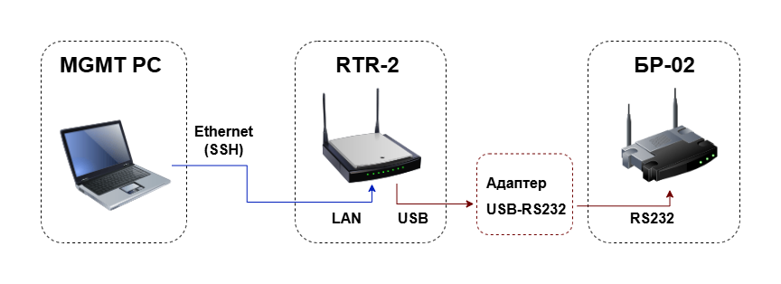

Данный сценарий демонстрирует использование RTR-2 в качестве промежуточного шлюза для удалённого доступа к консоли БР-02 через RS232.

Решение позволяет инженеру провести диагностику БР-02 даже в случае, когда устройство недоступно по сети, а на объекте присутствует только выездная бригада без квалификации для настройки оборудования.

### Схема подключения стенда:



Для упрощения сценария предполагается, что подключение к RTR-2 выполняется напрямую по IP-адресу LAN-интерфейса.

Типовой сценарий использования:
- БР-02 перестал отвечать по сети
- на объект выезжает сервисная бригада
- сотрудники подключают RTR-2 к БР-02 через USB-RS232
- инженер удалённо подключается к RTR-2 по SSH
- далее инженер получает доступ к консоли БР-02 через RS232 и выполняет диагностику устройства

### 1. Проверка подключения переходника на RTR-2

Подключите USB-RS232 переходник к RTR-2 и убедитесь, что устройство определилось в системе.

Команда проверки:

```bash
dmesg | grep tty
```

Пример вывода:

```bash
root@BITCORD-RTR-2:~# dmesg | grep tty
[   23.112916] ch341-uart ttyUSB0: break control not supported, using simulated break
[   23.128216] usb 1-1.2: ch341-uart converter now attached to ttyUSB0
```

В данном примере переходник определился как `/dev/ttyUSB0`. 

### 2. Подключение к консоли БР-02 через picocom

Для подключения к последовательной консоли используется утилита picocom. Системная скорость консольного порта БР-02: 115200 baud.

Выполните команду подключения:

```bash
picocom -b 115200 /dev/ttyUSB0
```

После появления сообщения `Terminal ready` нажмите Enter для активации консоли БР-02. 

После этого инженер получает удалённый доступ к устройству и может выполнить диагностику или восстановление его работы.

Для выхода из консоли picocom и возврата в терминал RTR-2 используйте последовательность Ctrl + A Ctrl + X.
