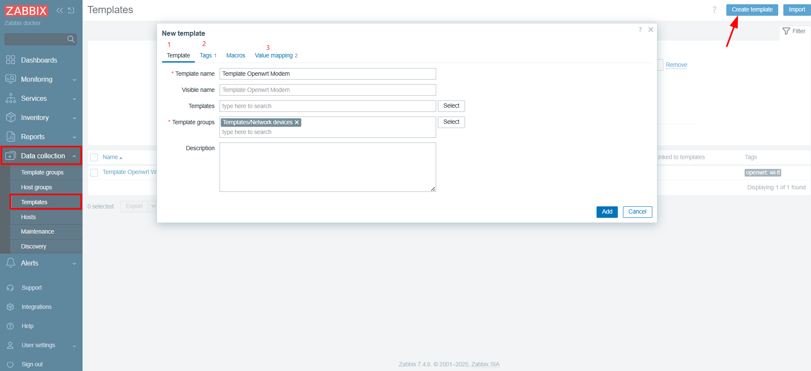
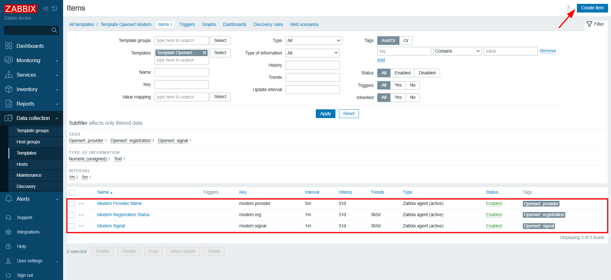
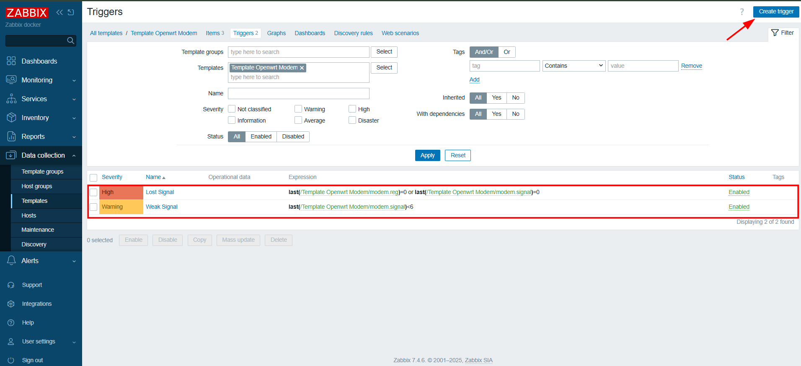
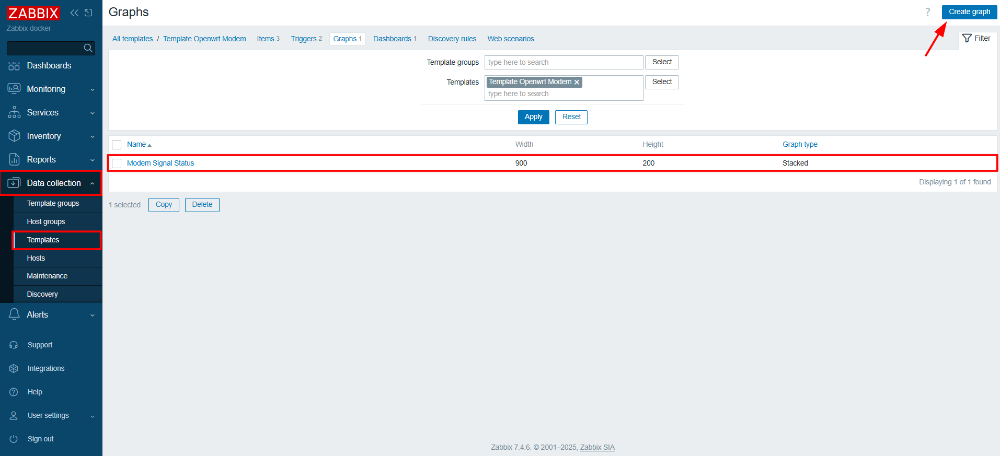
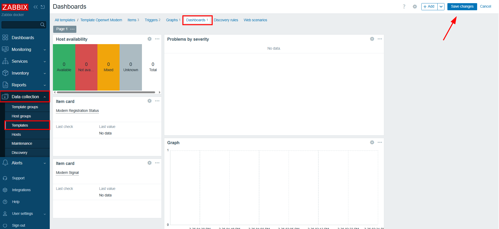
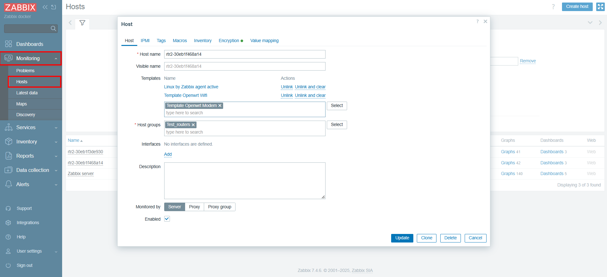
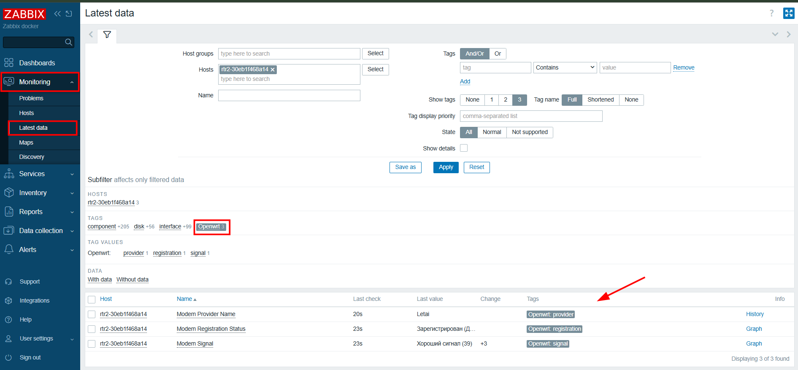

Данная инструкция описывает настройку мониторинга мобильного модема на устройстве под управлением OpenWrt с использованием Zabbix-агента (active). Информация о состоянии модема собирается системным модулем tsmodem.driver и доступна через шину UBUS. Zabbix-агент получает эти данные и отправляет их на сервер мониторинга.

В рамках данной инструкции настраивается мониторинг следующих параметров:

- Статус регистрации SIM-карты в сети оператора
- Уровень сигнала мобильной сети
- Наименование оператора связи

# 1. Подготовка 

### 1.1 Проверка Zabbix-агента

Проверьте статус:

``` bash
/etc/init.d/zabbix_agentd status

# Если агент не запущен:
/etc/init.d/zabbix_agentd start
```

Ожидаемый ответ:

``` bash
root@BITCORD-RTR-2:/# /etc/init.d/zabbix_agentd status
running
```

### 1.2 Проверка работы tsmodem.driver

Модуль должен корректно отвечать через UBUS.

Выполните:

``` bash
ubus call tsmodem.driver signal
ubus call tsmodem.driver reg
ubus call tsmodem.driver provider_name
```

Пример ответа:

``` bash
root@BITCORD-RTR-2:/# ubus call tsmodem.driver signal
{
        "comment": "",
        "value": "36",
        "unread": "false",
        "time": "1772095488",
        "command": "AT+CSQ"
}
root@BITCORD-RTR-2:/# ubus call tsmodem.driver reg
{
        "comment": "",
        "value": "1",
        "unread": "false",
        "time": "1772095497",
        "command": "AT+CREG?"
}
root@BITCORD-RTR-2:/# ubus call tsmodem.driver provider_name
{
        "comment": "25027",
        "value": "Letai",
        "unread": "false",
        "time": "1772088870",
        "command": "AT+COPS?"
}
```

Если ответ пустой или возникает ошибка — необходимо проверить работу модема и драйвера. 

Если при вызове команды provider_name приходит пустой ответ, убедитесь, что в конфигурации /etc/config/tsmodem_adapter_provider указаны настройки вашего провайдера.

Пример конфигурации провайдера: 

``` bash
config adapter '25027'
        option name 'Letai'
        option code '25027'
        option balance_ussd '*100#'
        option balance_mask '__RUB__ ;'
        option balance_example_message '550;0=A'
        option gate_address 'internet.letai.ru'
        option editable '1'
        option balance_last_message ' 0 ; 0 = A"'
```

### 1.3 Проверка jsonfilter

Утилита используется для извлечения значений из JSON. Проверьте, что пакет установлен:

``` bash
which jsonfilter  

# Если отсутствует, установите
opkg update && opkg install jsonfilter
```

Пример ответа: 

``` bash
root@BITCORD-RTR-2:/# which jsonfilter
/usr/bin/jsonfilter
```

# 2. Настройка Zabbix-агента на роутере 

### 2.1 Создание файла UserParameter

Создаём отдельный конфигурационный файл для параметров модема:

``` bash
# Настройка прав агента
sed -i 's/^#\?\s*AllowRoot=.*/AllowRoot=1/' /etc/zabbix_agentd.conf
sed -i 's/^User=zabbix/# User=zabbix/' /etc/zabbix_agentd.conf

# Блокируем выполнение произвольных команд
grep -q "DenyKey=" /etc/zabbix_agentd.conf || echo "DenyKey=system.run[*]" >> /etc/zabbix_agentd.conf
sed -i 's/^#\?\s*DenyKey=.*/DenyKey=system.run[*]/' /etc/zabbix_agentd.conf

# Создание конфигурации метрик
cat > /etc/zabbix_agentd.conf.d/modem.conf << 'EOF'
UserParameter=modem.reg,ubus call tsmodem.driver reg | jsonfilter -e '@.value'
UserParameter=modem.signal,ubus call tsmodem.driver signal | jsonfilter -e '@.value'
UserParameter=modem.provider,ubus call tsmodem.driver provider_name | jsonfilter -e '@.value'
EOF
```

Описание параметров:

- **modem.reg** — статус регистрации SIM-карты
- **modem.signal** — уровень сигнала 
- **modem.provider** — имя оператора

Так как для доступа к драйверу модема агенту требуются права суперпользователя (AllowRoot=1), в конфигурацию добавлена защита от удаленного выполнения произвольных команд: параметр DenyKey — блокирует возможность запуска любых сторонних скриптов.

### 2.2 Перезапуск агента

``` bash
/etc/init.d/zabbix_agentd restart 
```

### 2.3 Проверка работы параметров

Проверьте вручную:

``` bash
zabbix_agentd -t modem.reg
zabbix_agentd -t modem.signal
zabbix_agentd -t modem.provider
```

Пример корректного ответа:

``` bash
root@BITCORD-RTR-2:/# zabbix_agentd -t modem.reg
modem.reg                                     [t|1]
root@BITCORD-RTR-2:/# zabbix_agentd -t modem.signal
modem.signal                                  [t|33]
root@BITCORD-RTR-2:/# zabbix_agentd -t modem.provider
modem.provider                                [t|Letai]
```

Если значения возвращаются — агент настроен корректно.

# 3. Настройка шаблона в Zabbix

### 3.1 Создание шаблона

После того как агент на роутере настроен и отдаёт данные, необходимо создать шаблон на стороне Zabbix-сервера.

Перейдите: *Data Collection → Templates → Create template*

Заполните:

**Name**: Template Openwrt Modem

**Template groups**: Templates/Network devices



Для удобства добавьте тег *Tags → Add*:

**Name**: Openwrt

**Value**: modem

Создайте преобразование значений *Value mapping → Add*:

1\) **Name**: Registration Status

**Mappings**:

|        |       |                                                                                         |
|--------|-------|-----------------------------------------------------------------------------------------|
| Type   | Value | Mapped to                                                                               |
| equals | 0     | <span class="T286Pc">Не зарегистрирован</span>                                          |
| equals | 1     | <span class="T286Pc"><span class="Yjhzub">Зарегистрирован (Домашняя сеть)</span></span> |
| equals | 2     | <span class="T286Pc">Поиск сети...</span>                                               |
| equals | 3     | <span class="T286Pc">Регистрация отклонена (Отказ SIM)</span>                           |
| equals | 4     | <span class="T286Pc">Неизвестно / Вне зоны</span>                                       |
| equals | 5     | <span class="T286Pc">Зарегистрирован (Роуминг)</span>                                   |
| equals | 6     | <span class="T286Pc">Ограничен: только SMS (Дом)</span>                                 |
| equals | 7     | <span class="T286Pc">Ограничен: только SMS (Роуминг)</span>                             |
| equals | 8     | <span class="T286Pc">Только экстренные вызовы</span>                                    |
| equals | 9     | <span class="T286Pc">Ограничение голоса (CSFB)</span>                                   |
| equals | 10    | <span class="T286Pc">Ограничение голоса (Роуминг)</span>                                |

2) **Name**: Signal Status

**Mappings**: 

|          |       |                       |
|----------|-------|-----------------------|
| Type     | Value | Mapped to             |
| in range | 0-9   | Очень слабый сигнал   |
| in range | 10-14 | Слабый сигнал         |
| in range | 15-20 | Средний сигнал        |
| in range | 21-98 | Хороший сигнал        |
| equals   | 99    | Неизвестно / Нет сети |

Нажмите кнопку *Add* для создания шаблона. 

# 4. Создание элементов данных (Items)

Перейдите в созданный шаблон *Data Collection → Templates → Template Openwrt Modem → Items → Create item*

### 4.1 Имя провайдера

**Name**: Modem Provider Name

**Type**: Zabbix agent (active)

**Key**: modem.provider

**Type of information**: Text

**Update interval**: 5m

### 4.2 Статус регистрации

**Name**: Modem Registration Status

**Type**: Zabbix agent (active)

**Key**: modem.reg

**Type of information**: Numeric (unsigned)

**Update interval**: 1m

**Value mapping** *→ Registration Status*

### 4.3 Уровень сигнала

**Name**: Modem Signal

**Type**: Zabbix agent (active)

**Key**: modem.signal

**Type of information**: Numeric (unsigned)

**Update interval**: 1m

**Value mapping** → Signal Status

При необходимости добавьте теги.



# 5. Настройка триггеров

Перейдите: *Triggers → Create trigger*

### 5.1 Потеря сети

**Name**: Lost Signal

**Event name**: Модем потерял регистрацию в сети

**Severity**: High

**Expression**:

last(/Template Openwrt Modem/modem.reg)=0 or last(/Template Openwrt Modem/modem.signal)=0

### 5.2 Слабый сигнал

**Name**: Weak Signal

**Event name**: Слабый уровень сигнала

**Severity**: Warning

**Expression**:

last(/Template Openwrt Modem/modem.signal)\<9

  



# 6. Создание графика

Перейдите: *Graphs → Create graph*

**Name**: Modem Signal Status

**Graph type**: Stacked

**Items** → Add → Modem Signal



# 7. Создание дашборда

Перейдите: *Dashboards → Create dashboard*

Name: Openwrt Modem Dashboard

Добавьте нужные виджеты. Например: 

1\) **Type**: Host availability

**Interface type**: Zabbix agent (active checks)

2\) **Type**: Problems 

3\) **Type**: Graph

**Item**: Modem Signal

4\) **Type**: Item card

**Item**: Modem Registration Status

**Show** *→* Name: Latest data

4\) **Type**: Item card

**Item**: Modem Signal

**Show** *→* Name: Latest data

Нажмите Save changes.



# 8. Привязка шаблона к хосту

Перейдите:

*Monitoring → Hosts → Выберите нужный хост*

В блоке Templates добавьте шаблон *Template OpenWrt Modem*

Нажмите Update.



# 9. Проверка мониторинга

После привязки шаблона:

Перейдите в *Monitoring → Latest data → Выберите хост → Для удобства отфильтруйте по добавленному на шаге 4 тегу*

Убедитесь, что появляются значения:

- Modem Registration Status
- Modem Signal
- Modem Provider Name



  
